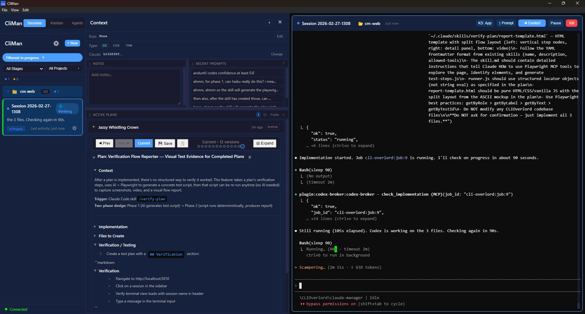
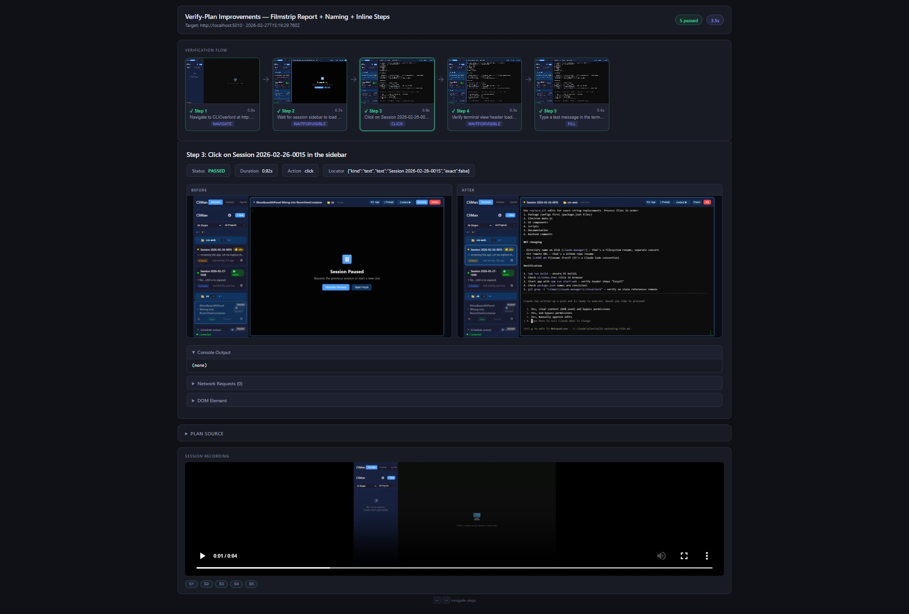

# EasyCC

**Easy CLI Context** — a cross-platform web UI (+ Electron desktop app) for managing multiple CLI sessions (Claude Code, Codex, and any other CLI tool). Combines terminal multiplexing, a Kanban workflow board, an agent/task system, and plan versioning into a single interface.



## Features

- **Multiple Sessions**: Run and manage multiple CLI sessions simultaneously (Claude Code, Codex, or any custom CLI)
- **Web-Based Terminal**: Full terminal emulation using xterm.js with split panes
- **Kanban Board**: Drag-and-drop workflow stages for sessions and tasks
- **Agent System**: Define reusable agent templates with auto-start/restart
- **Plan Versioning**: Track, diff, and snapshot plan files across sessions
- **Real-Time Updates**: WebSocket-based live status updates
- **Vimium-style Hints**: Keyboard-first navigation (backtick to toggle)
- **Cross-Platform**: Works on Windows, macOS, and Linux
- **Desktop App**: Native Windows app with taskbar icon and system tray



## Quick Start

```bash
# Install all dependencies (root, backend, and UI)
npm run install:all

# Build UI + start in production mode
npm run build
npm run start:web
```

Access at: **http://localhost:5010**

### Development (hot reload)

```bash
npm run dev
```
- Frontend: http://localhost:5011 (Vite dev server with HMR)
- Backend: http://localhost:5010

> **Note:** For full terminal I/O, use production mode (`npm run start:web`). The Vite dev proxy has known WebSocket issues.

### Desktop App

```bash
npm run build
npm start           # Launch Electron desktop app
```

See **[ELECTRON.md](ELECTRON.md)** for full desktop app documentation.

## Prerequisites

- Node.js 18+
- One or more supported CLIs installed and accessible in PATH (e.g. `claude`, `codex`, or any terminal command)
- npm

## Keyboard Shortcuts

| Shortcut | Action |
|----------|--------|
| `` ` `` (backtick) | Toggle hint mode (Vimium-style) |
| `Ctrl+O` | Toggle sessions / kanban / agents view |
| `Ctrl+W` | Close current session |
| `Alt+Shift+=` | Split terminal right |
| `Alt+Shift+-` | Split terminal bottom |
| `Alt+Arrow` | Focus adjacent pane |
| `Ctrl+E` / `Ctrl+R` | Next / prev session |

## Project Structure

```
easycc/
├── backend/                    # Fastify + node-pty server
│   ├── server.js               # REST API + WebSocket
│   ├── sessionManager.js       # PTY lifecycle, status detection
│   ├── planManager.js          # Plan file watching
│   ├── agentStore.js           # Agent CRUD
│   └── taskStore.js            # Task CRUD
├── ui/                         # React 18 + Vite 5
│   └── src/
│       ├── App.jsx             # Main layout, view switching
│       ├── components/         # 25+ components
│       ├── hooks/              # 7 custom hooks
│       └── index.css           # All CSS (single file)
├── electron/                   # Electron desktop wrapper
│   └── main.js                 # BrowserWindow, system tray
└── data/                       # Runtime persistence (gitignored)
```

## API Reference

### REST Endpoints

| Method | Path | Description |
|--------|------|-------------|
| GET | /api/sessions | List all sessions |
| POST | /api/sessions | Create session `{name, workingDir, cliType}` |
| DELETE | /api/sessions/:id | Kill session |
| GET | /api/agents | List agents |
| GET | /api/tasks | List tasks |
| GET | /api/plans | List plan files |

### WebSocket Endpoints

| Path | Description |
|------|-------------|
| /socket/dashboard | Streams all session/agent/task status changes |
| /socket/sessions/:id/terminal | Real-time terminal I/O for xterm.js |

## Troubleshooting

### CLI not found

Ensure your CLI tool is installed and in PATH:
```bash
claude --version   # Claude Code CLI
codex --version    # Codex CLI
```

### Port already in use

**Windows (PowerShell):**
```powershell
Stop-Process -Id (Get-NetTCPConnection -LocalPort 5010).OwningProcess -Force
```

**macOS/Linux:**
```bash
lsof -ti:5010 | xargs kill -9
```

## License

MIT
